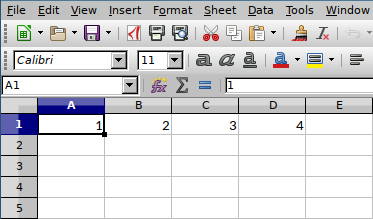

Extending bcompiler
=======================

The main functionality of ``bcompiler`` is obtained via the command line, e.g::

    bcompiler -h

is used to obtain the basic help menu.

In addition, ``bcompiler`` allows anyone with a knowledge of basic Python to be
able to interact with the program and to generate their own output. Some parts
of ``bcompiler`` are 'exposed' to the user via an API (Application Programming
Interface) which is designed to be easy to use and useful as a component to
building new functionality.

In this version of ``bcompiler`` (1.3 series), the API is very limited, however
it allows you to interrogate the data held in an master xlsx file and do things
with the data. Essentially ``bcompiler`` does the hard work of pulling the data
out of a master, formatting it in some way, and presenting it to you in
a format for doing something else with, e.g. writing it to another file, such
as an Excel or a Word document.

The key API objects documented here are:

* :ref:`master`
* :ref:`quarter`
* :ref:`financial_year`
* :ref:`row`

Examples
++++++++

Filtering project data
~~~~~~~~~~~~~~~~~~~~~~

One of the most simple tasks might be to list the projects contained with
a particular master file::

    from bcompiler.api import project_data_from_master
    m = project_data_from_master('/tmp/master_1_2017.xlsx', 1, 2017)
    m.projects

output: ``['Project Name 1', 'Project Name 2', ...]``

Say you wish to interrogate a master file and output all values from keys which
contain the word "Total" in a project whose title is "Project Name 1". Here's what
you could do::

    from bcompiler.api import project_data_from_master
    m = project_data_from_master('/tmp/master_1_2017.xlsx', 1, 2017)
    p = m['Project Name 1']
    totals = p.key_filter("Total")

output: ``[('Import Total Budget/BL', 10), ('Another Total Budget/BL',
199.1),```
...

Checking for duplicate keys in a master
~~~~~~~~~~~~~~~~~~~~~~~~~~~~~~~~~~~~~~~

A master file containing duplicate keys will not function correctly.
``bcompiler`` will test for this during its normal operation, but if you wish
to check a master file yourself, you can do this very easily once you have
a :py:class:`bcompiler.api.Master` object, obtained using the
``project_data_from_master`` function as demonstrated above, or by directly
creating a :py:class:`bcompiler.api.Master` object (see :ref:`master`)::

    from bcompiler.api import project_data_from_master
    m = project_data_from_master('/tmp/master_1_2017.xlsx', 1, 2017)
    m.duplicate_keys()

output: ``False`` if there are no duplicate keys, ``True`` otherwise.


Computing financial quarter/year dates
~~~~~~~~~~~~~~~~~~~~~~~~~~~~~~~~~~~~~~

You're writing a script that requires computation involved with financial
years...::

    from bcompiler.api import FinancialYear
    fy = FinancialYear(2016)
    fy.start_date

output: ``datetime.date(2016, 4, 1)``::

    fy.end_date

output: ``datetime.date(2017, 3, 31)``::

    quarter1_2016 = fy.q1

output: ``Quarter(1, 2016)``::

    quarter1_2016.fy

output: ``2016``::

    quarter1_2016.end_date

output: ``datetime.date(2016, 6, 30)``


Writing data to a new Excel file
~~~~~~~~~~~~~~~~~~~~~~~~~~~~~~~~

You are writing a program that exports data from a master file to another
workbook, in the same way that bcompiler analysers work.

To write data into a row in your workbook, ``bcompiler`` will do the hard work
for you - you don't have to write data into individual cells. Use the
:py:class:`bcompiler.api.Row` object::

    from openpyxl import Workbook

    from bcompiler.api import Row

    data = [1, 2, 3, 4]

    wb = Worbook()
    ws = wb.active

    r = Row(1, 1, data)
    r.bind(ws)

    wb.save('/tmp/test.xlsx')

output: an Excel file at ``/tmp/test.xlsx`` whose default sheet contains a row
of values: ``1 2 3 4``, starting at cell ``A1`` (or 1, 1).



This could be combined with other elements of the API, for example to write the
list of project titles from a master file to a new Excel file::

    from openpyxl import Workbook

    from bcompiler.api import Row
    from bcompiler.api import project_data_from_master

    m = project_data_from_master('/tmp/master_1_2017.xlsx', 1, 2017)
    projects = m.projects

    wb = Worbook()
    ws = wb.active

    r = Row(1, 1, projects)
    r.bind(ws)

    wb.save('/tmp/test.xlsx')

You can also use the column letter as the first parameter in the ``Row()``
function::

    r = Row('A', 1, projects)

and the effect will be the same.


.. _api-ref:

API Reference
+++++++++++++


.. _master:

Master
~~~~~~

.. autoclass:: bcompiler.api.Master
    :members:
    :undoc-members:


project_data_from_master
************************

As well as dealing with ``Master`` objects directly, the
:py:func:`bcompiler.api.project_data_from_master` function does exactly the
same job.

.. autofunction:: bcompiler.api.project_data_from_master


.. _quarter:

Quarter
~~~~~~~

.. py:class:: bcompiler.api.Quarter(quarter, year)

A Quarter object enapsulates data about a financial quarter in ``bcompiler``.
Because it contains data about dates (start dates and end dates for
a particular quarter, for instance), it can be used for calculating differences
between dates and ordering objects which are associated with it. A good example
is a :py:class:`bcompiler.api.Master` object, which is a composition of an Excel file
(providing the data) and a :py:class:`bcompiler.api.Quarter` object (providing
temporal data). This allows ``bcompiler`` and anyone using
a :py:class:`bcompiler.api.Master` object to order data by date.

To create a ``Quarter`` object is very easy::
    
    from bcompiler.api import Quarter
    q1 = Quarter(2, 2015)

The following attributes of the resulting object are available:

    .. py:attribute:: year 

    An integer representing the calendar year.

    .. py:attribute:: quarter
    
    An integer representing the quarter (1, 2, 3 or 4)

    .. py:attribute:: start_date
    
    A :py:class:`datetime.date` object

    .. py:attribute:: end_date
    
    A :py:class:`datetime.date` object

    .. py:attribute:: fy
    
    A :py:class:`bcompiler.api.FinancialYear` object


.. _financial_year:

FinancialYear
~~~~~~~~~~~~~

.. autoclass:: bcompiler.api.FinancialYear
    :members:


.. _row:

Row
~~~

.. autoclass:: bcompiler.api.Row
    :members:
