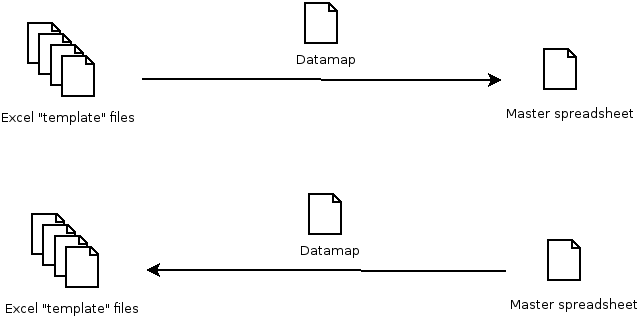

Introduction
=============

``bcompiler`` is a tool to manage data involved in the BICC reporting process at the UK Department for Transport.

It is developed and maintained by `Matthew Lemon
<https://twitter.com/matthewlemon>`_ and licensed under `MIT
<https://opensource.org/licenses/MIT>`_. Source code is available at `Bitbucket
<https://bitbucket.org/mrlemon/bcompiler/overview>`_.

``bcompiler`` processes data held in Excel files, either compiling similar data
from many Excel files into a single master spreadsheet, or populating many
Excel files using the data from a master spreadsheet.

"Auxiliary" files (see :ref:`aux_files`) are required to map data in each direction, and to templates.
These files are contained in a DfT reporitory on GitHub. ``bcompiler`` can be
used to obtain/update these files.

Quick Start
-----------

* Ensure Python 3.6.2 or later is installed on your system.
* Ensure git is installed on your system.
* ``pip install bcompiler``
* ``bcompiler-init``
* Refer to :ref:`use`.

Concept
-------

Template and master
~~~~~~~~~~~~~~~~~~~~~

The primary function of ``bcompiler`` is very simple:
it extracts data from one Excel spreadsheet and puts it into another
spreadsheet. More specifically, it extracts data from a spreadsheet which has
an ad hoc layout, and multiple sheets (which we call a *template*), and puts it
into a simple database-like table on a single sheet (which we call a *master*).
The template is a controlled document which is intended to be completed as
a form by some stakeholder and the master is a document store which holds data
from multiple templates.  It could therefore be said ``bcompiler`` is
a collection tool that gathers data from a controlled, Excel-based, user
interface and "compiles" it into a central point, allowing for storage or
further interrogation by other tools, such as Excel or even ``bcompiler``
itself, as we shall see.

This process can also be operated in reverse, i.e. data can be transferred from
a master to a set of templates.

Datamap
~~~~~~~

A template is intended to be used as a form to collect data. It's design is
free-form and should facilitate data-entry in a user-friendly way, therefore it
is likely to contain:

* empty cells, for the user to complete
* locked cells, containing formulae
* locked cells, for spacing or other aesthetic purposes
* cells controlled by data verification, such as drop-down lists
* styled cells and various formatting
* any other plausible design element which facilitates successful data-entry

When seeking to extract data from a template which has been populated by
a user, the task is therefore to know which cells in the template contain the
data entered and which can be ignored as cells used for aesthetics, user
information, spacing, design, etc. This is achieved in ``bcompiler`` using
a *datamap*.

The datamap is a simple CSV file which maps *keys* to *values*. The key is the
arbitary name, or descriptor of some piece of data you want to capture, and the
value is the data contained in the cell which represents that piece of data.
The job of the datamap is to tell ``bcompiler`` which cell in the template
contains that piece of data you want to capture.

An extract from a datamap::

    First Name,Summary,F10,
    Last Name,Summary,F11
    Date of Birth,Summary,G10,
    Nickname,Summary,G11

Here, "First Name" is a *key*, whose *value* can be found in cell *F10* of the
*Summary* sheet in the target template. Likewise for "Last Name", "Date of
Birth", etc.

.. note::

    The datamap (called ``datamap.csv``) is an *auxiliary file* (see
    :ref:`aux_files`), created by ``bcompiler`` in a special location inside
    the the ``Documents`` folder of your computer. An auxiliary file is simply
    a file whose contents help ``bcompiler`` do its job and can be amended by
    any user of the program.

.. warning::

    Without a correctly populated datamap, ``bcompiler`` has no way of finding
    or placing data, so it is an essential component of the process and can be
    the source errors and unexpected values.

Designing or amending a template
~~~~~~~~~~~~~~~~~~~~~~~~~~~~~~~~~~

The process of designing a new template (or amending and existing one) is
therefore very straightforward.

The template is laid-out according to whatever design/principles are
suitable. Cell-locking and other security measures are inacted within the Excel
file to control where data can be entered by the user and to protect formulas,
adding or deleted rows/columns, etc.

A ``datamap.csv`` file is then created (or amended if changing an existing
template), using Excel or Notepad or any other text editing application, and
each cell in the template intended to be populated by the user and/or captured
by ``bcompiler`` is listed on a single line, in CSV (comma-seperated) format::

    First Name,Summary,F10,
    Last Name,Summary,F11
    Date of Birth,Summary,G10,
    Nickname,Summary,G11
    Data Field 1,Finance,A3
    Data Field 2,Finance,A4
    ...

The ``datamap.csv`` file is saved and placed in the ``bcompiler/source/``
directory in the computer's ``Documents`` directory (the name of which differs
depending on whether using Windows, Mac OS X or Linux).

